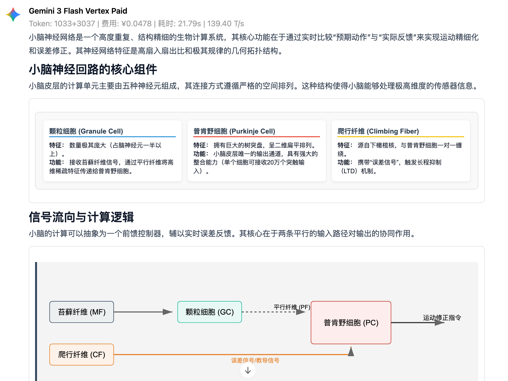

# OpenWebUI HTML Renderer

一个给 OpenWebUI 使用的 Tampermonkey / 油猴用户脚本。可以把模型直接输出的裸 HTML 文本块渲染成可视化内容，增加内容可读性。

一键安装：[Greasy Fork - OpenWebUI HTML Renderer](https://greasyfork.org/zh-CN/scripts/577558-openwebui-html-renderer)

## 效果预览



## 功能

- 识别 OpenWebUI 消息里作为文本节点出现的 `<div>...</div>`、`<table>...</table>` 等 HTML 片段。
- 支持 HTML 块前置 `<style>...</style>`。
- 渲染成功后隐藏原始 HTML 文本，页面只显示预览效果。
- 支持流式输出：HTML 片段闭合后会自动渲染，未完成的半截 HTML 会继续保持原文。
- 渲染块右上角提供三个按钮：复制为 PNG 图像、下载 SVG、复制 HTML 源码。
- 总开关：`HTML 渲染当前已开启/已关闭，点击切换`。

## 安装

一键安装，或者：

1. 安装 Tampermonkey、Violentmonkey 或其他兼容用户脚本管理器。
2. 打开 [openwebui-html-renderer.user.js](./openwebui-html-renderer.user.js)。
3. 将脚本内容复制到用户脚本管理器，保存启用。
4. 进入 OpenWebUI 页面后刷新一次。

把脚本头部的 `@match` 改成你的地址：

```js
// @match https://openwebui.example.com/*
// @match http://192.168.1.20:3000/*
```

## 推荐输出格式

让模型直接输出 HTML，不需要代码块：

```html
<div style="display:flex; gap:12px;">
  <div style="border:1px solid #ddd; padding:12px;">小脑半球</div>
  <div style="border:1px solid #ddd; padding:12px;">小脑蚓部</div>
</div>
```

参考 HTML 模板 Prompt：

```html
<format>
  <rule>标题从 ## 起，子层级使用 ###；禁用 #</rule>
  <rule>使用简体中文</rule>
  <rule>保持高信息密度和紧凑的行文</rule>
  <rule>保持紧凑的回复格式，避免松散的内容给用户带来阅读障碍</rule>
  <rule>代码块标注语言，优先完整可运行，复杂逻辑添加注释</rule>
  <rule id="html-visual">
    <rationale>
      纯 Markdown
      的固定垂直流式结构在表达复杂逻辑时存在先天缺陷（阅读疲劳、重点不突出、缺乏真正的图表与横向排版能力）。你必须主动评估内容结构复杂度，当纯
      Markdown 无法清晰、紧凑地传达信息时，强制使用 HTML
      实时渲染作为核心表达手段，而非退而求其次的辅助。
    </rationale>
    <default-trigger>
      遇到以下情形，必须放弃纯 Markdown 列表或表格的敷衍表达，主动切入 HTML
      内嵌排版：
      <case type="logic-graph"
        >逻辑与结构图：流程图、架构图、状态机、树状层级、思维导图等任何包含节点与连线关系的逻辑（用
        HTML/CSS 的 DOM 结构与箭头符号构建）。</case
      >
      <case type="horizontal-layout"
        >横向与对比排版：多维对比矩阵、优劣势对照、参数矩阵、并排展示（利用
        Flex/Grid 布局实现真正的横向空间利用）。</case
      >
      <case type="info-card"
        >数据与信息卡片：多字段聚合展示、需要视觉分组与边框隔离的密集信息。</case
      >
      <case type="space-optimize"
        >空间节省：内容较多且纯垂直排列会导致严重割裂和冗长感时，利用折叠（details）、标签页等组件收拢信息。</case
      >
    </default-trigger>
    <vision-plus>
      Vision+ 指令是视觉表达能力的升维，仅当用户显式声明时启用。
      <capability
        >允许使用内联 SVG 或 CSS
        绘制真正的矢量逻辑图、结构连线、几何图形与数据图表（如柱状图、饼图），突破
        DOM+文字模拟图表的局限。</capability
      >
      <capability
        >允许使用更复杂的 CSS 特效（渐变、阴影、动画 hover
        反馈）和高级交互组件。</capability
      >
      <capability
        >声明 Vision+
        后，应更激进地优先考虑图形化表达，将抽象文字逻辑直接转译为可视化元素。</capability
      >
    </vision-plus>
    <boundary>
      <constraint
        >永远仅输出自包含片段：只输出 div, svg, style, script
        等局部渲染标签，绝对禁止输出 !DOCTYPE, html, head, body
        等全量页面框架结构，本末倒置将导致直接判错。</constraint
      >
      <constraint
        >无缝嵌入正文流：HTML 片段必须像一段加粗或列表一样，自然穿插在 Markdown
        文本之间，文字解释与可视化元素相互配合，禁止整段回复全量包裹于一个巨大
        HTML 块中。</constraint
      >
    </boundary>
  </rule>
</format>
```
